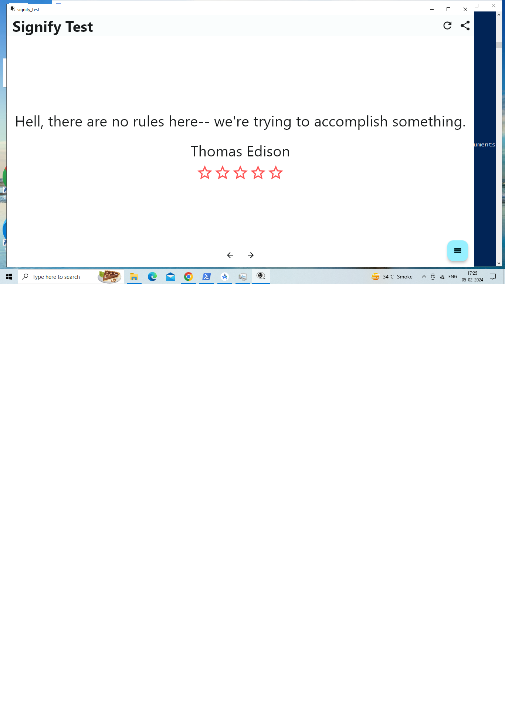
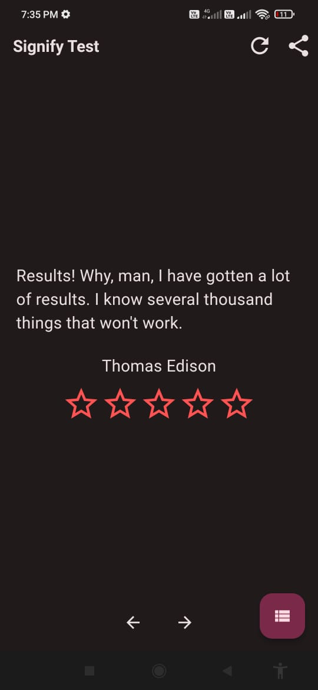
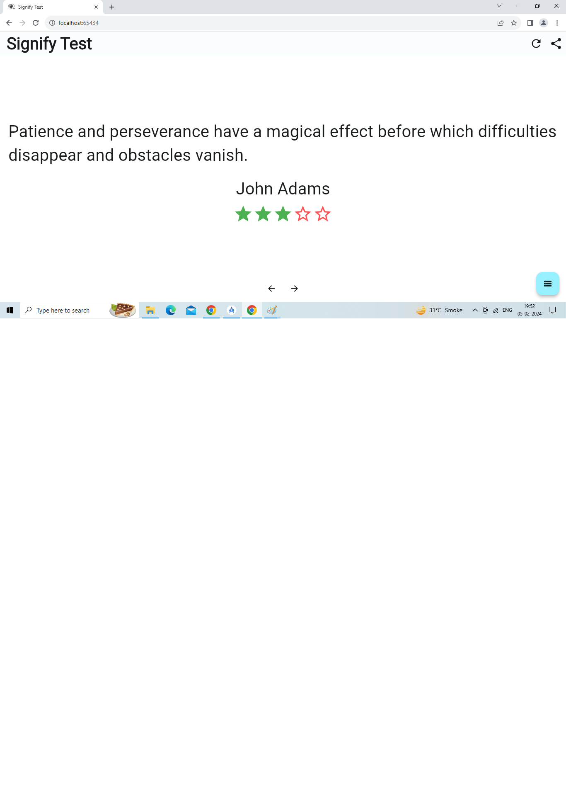
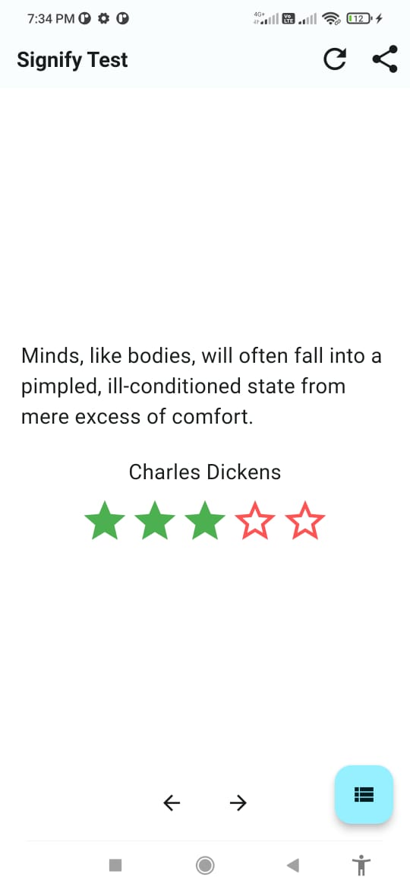
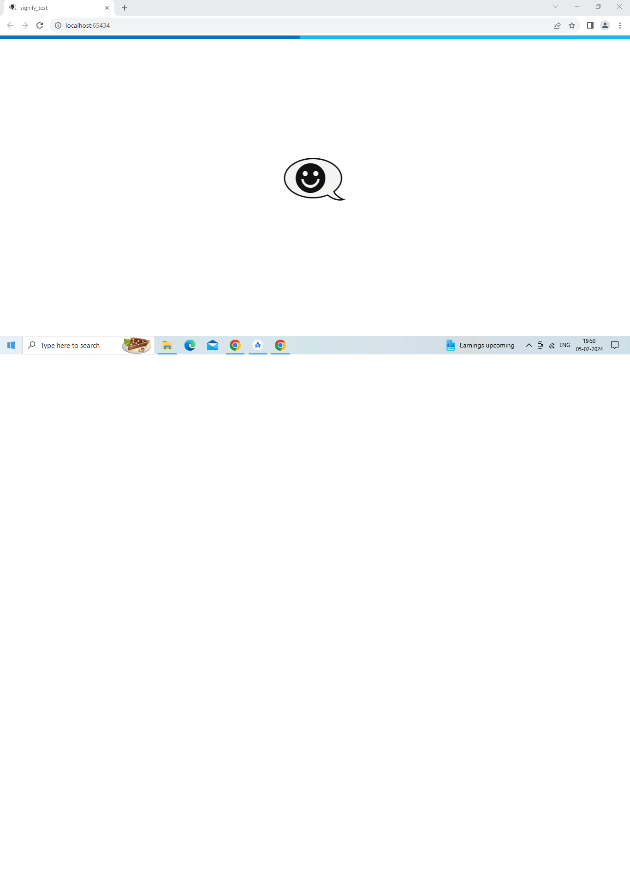

# Signify Test App
Signify Test App
## Screenshots










## Features

- Fetch list of quote
- Fetch random quote
- Share on social media
- Rate a quote

## Installation

Install Dependencies
flutter pub get 

Run the App on Android
flutter run -d android

Run the App on iOS
flutter run -d ios

Run the App for Web
flutter run -d web

Run the App for Windows
flutter run -d windows
### Prerequisites

Make sure you have the following installed on your machine:

- [Flutter](https://flutter.dev/docs/get-started/install)

### Clone the Repository

```bash
git clone https://github.com/amolyadav25/signnifytest.git
cd signnify_test 
flutter run -d "your device id"


